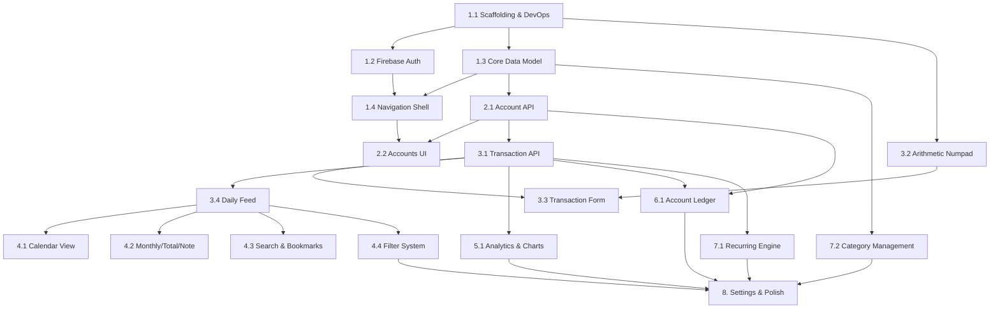

# Finance Tracker — Technical Implementation Plan

> **Source of Truth**: [requirements.md](file:///home/encora/explorer/finance-tracker-2/requirements.md)
> **Stack**: Next.js (App Router, `output: 'standalone'`), TypeScript, shadcn/ui, Firebase Auth, Prisma, PostgreSQL, PWA, Docker
> **CRITICLE**: MUST always follow the rules defined in `.agents/rules/*`

---

## Phase 1 — Foundation & Infrastructure

**Objective**: Establish the project skeleton, database, authentication, navigation shell, and core layout so all subsequent phases have a working end-to-end surface to build on.

**Requirements Covered**: P1–P8, §2.1, §2.2, §3.1–§3.3, §9.1 (shell only)

**Major Deliverables**: Working Next.js app with Docker + PostgreSQL, Firebase Auth, protected routes, responsive navigation shell, seed data on registration.

**Dependencies**: None (first phase).

---

### Milestone 1.1 — Project Scaffolding & DevOps

**Goal**: Bootable Next.js app with Docker Compose, PostgreSQL, Prisma, and shadcn/ui installed.

**Deliverables**: `docker-compose.yml`, `Dockerfile`, Prisma connection, shadcn initialized, base layout.

**Dependencies**: None.

#### Task 1.1.1 — Initialize Next.js Project

- **Description**: Create a Next.js App Router project with TypeScript.
- **Approach**: `npx -y create-next-app@latest ./ --ts --app --eslint --src-dir --import-alias "@/*" --tailwind --no-turbopack`. Configure `next.config.ts` with `output: 'standalone'`. Set up path aliases.
- **Requirement**: §Architecture header (Next.js with SSR & Server APIs).
- **Dependencies**: None.
- **Acceptance**: `npm run dev` starts without error; App Router renders a placeholder page.

#### Task 1.1.2 — Docker Compose & PostgreSQL

- **Description**: Create multi-stage `Dockerfile` and `docker-compose.yml` with PostgreSQL service.
- **Approach**: Multi-stage Dockerfile (deps → build → standalone runner). Docker Compose with `postgres:16` service, volume mount, health check. `.env` with `DATABASE_URL`. Standalone output confirmed.
- **Requirement**: §Deployment, §Database.
- **Dependencies**: Task 1.1.1.
- **Acceptance**: `docker compose up` starts Next.js + Postgres; app accessible at `localhost:3000`.

#### Task 1.1.3 — Prisma Setup & Base Schema

- **Description**: Install Prisma, create initial schema with User model, run first migration.
- **Approach**: `npx prisma init`. Configure `datasource` for PostgreSQL. Create `User` model with `id`, `firebaseUid` (unique), `email`, `displayName`, `avatarUrl`, `baseCurrency` (default `INR`), `createdAt`, `updatedAt`. Create a singleton Prisma client utility (`src/lib/prisma.ts`). Run `npx prisma migrate dev`.
- **Requirement**: §Language & Tooling (Prisma), §2.2 (user profile with base currency INR).
- **Dependencies**: Task 1.1.2.
- **Acceptance**: Migration applies cleanly; `npx prisma studio` shows User table.

#### Task 1.1.4 — shadcn/ui Initialization & Design Tokens

- **Description**: Initialize shadcn/ui, configure theme with project color tokens, install foundational components.
- **Approach**: `npx shadcn@latest init`. Set up CSS variables for color palette (income-blue, expense-red, transfer-neutral, liability-warning). Install base components: `button`, `card`, `input`, `dialog`, `sheet`, `tabs`, `badge`, `skeleton`, `separator`, `tooltip`, `avatar`, `dropdown-menu`. Set up Google Fonts (Inter). Configure `tabular-nums` utility.
- **Requirement**: P7 (shadcn/ui design system, tabular-nums), §UI Foundation.
- **Dependencies**: Task 1.1.1.
- **Acceptance**: Components render correctly; theme tokens applied; `tabular-nums` class works on monetary values.

#### Task 1.1.5 — PWA Manifest & Service Worker Shell

- **Description**: Configure PWA installability with manifest and offline app shell.
- **Approach**: Create `public/manifest.json` with app name, icons, theme color, `display: standalone`. Add `next-pwa` or manual service worker for offline shell (cache app shell assets only — all data ops remain online-only per P1). Add meta tags for iOS safe-area and viewport.
- **Requirement**: P1 (Online-Only with offline shell), §Responsive Web & PWA UX rule.
- **Dependencies**: Task 1.1.1.
- **Acceptance**: App passes Lighthouse PWA installability checks; offline loads app shell with connectivity banner.

---

### Milestone 1.2 — Firebase Authentication

**Goal**: Complete auth flow — login, register, forgot password, session management, route protection.

**Deliverables**: Auth pages, Firebase client/admin SDK integration, middleware, session cookies.

**Dependencies**: Milestone 1.1.

#### Task 1.2.1 — Firebase Client SDK Setup

- **Description**: Configure Firebase client SDK with environment variables.
- **Approach**: Install `firebase`. Create `src/lib/firebase/client.ts` exporting initialized Firebase app, `getAuth()`. Store config in env vars (`NEXT_PUBLIC_FIREBASE_*`). Create auth helper functions: `signInWithEmail`, `signUpWithEmail`, `signInWithGoogle`, `signOut`, `sendPasswordReset`.
- **Requirement**: §2.1 (Email/password, Google OAuth2, password-reset).
- **Dependencies**: Milestone 1.1.
- **Acceptance**: Firebase app initializes without error.

#### Task 1.2.2 — Firebase Admin SDK & Session Management

- **Description**: Server-side token verification and cookie-based sessions.
- **Approach**: Install `firebase-admin`. Create `src/lib/firebase/admin.ts` with service account init (env vars). Create API route `POST /api/auth/session` that receives Firebase ID token, verifies it, creates a session cookie (`__session`, HTTP-only, secure, SameSite=Lax, 14-day expiry). Create `DELETE /api/auth/session` for logout (clear cookie). Create `src/lib/auth/session.ts` with `getServerSession()` that reads cookie, verifies with Admin SDK, returns decoded user.
- **Requirement**: §2.1 (Secure cookie-based sessions, HTTP-only tokens, server-side verification).
- **Dependencies**: Task 1.2.1.
- **Acceptance**: Login creates session cookie; `getServerSession()` returns user from cookie; logout clears cookie.

#### Task 1.2.3 — Route Protection Middleware

- **Description**: Protect all routes except public auth pages.
- **Approach**: Create `src/middleware.ts`. Match all routes except `/login`, `/register`, `/forgot-password`, `/api/auth/*`, and static assets. Check for session cookie presence. If absent, redirect to `/login`. For API routes, return 401. Add `x-user-uid` header from verified session for downstream use.
- **Requirement**: P2 (Login-Only Access, unauthenticated redirects to login).
- **Dependencies**: Task 1.2.2.
- **Acceptance**: Unauthenticated requests to any protected route redirect to `/login`; API calls return 401.

#### Task 1.2.4 — Auth Pages (Login, Register, Forgot Password)

- **Description**: Build the three public auth pages with form validation.
- **Approach**: Create `src/app/(auth)/login/page.tsx`, `register/page.tsx`, `forgot-password/page.tsx`. Use shadcn `Card`, `Input`, `Button`, `Label`. Login: email + password fields, "Sign in with Google" button, links to register and forgot-password. Register: email + password + confirm password. Forgot Password: email field + send reset link. All forms use client-side validation (required fields, email format, password min length). On success: obtain Firebase ID token → call `POST /api/auth/session` → redirect to `/`.
- **Requirement**: §2.1 (Providers, validation).
- **Dependencies**: Tasks 1.2.1–1.2.3.
- **Acceptance**: User can register, login (email + Google), reset password; session cookie set; redirected to dashboard.

#### Task 1.2.5 — User Provisioning & Seed Data

- **Description**: On first login, create user record in PostgreSQL and seed default accounts + categories.
- **Approach**: Create `src/lib/auth/provision.ts`. After session creation, check if `User` exists by `firebaseUid`. If not, run a Prisma transaction that creates: (1) User record, (2) 3 default accounts (Cash Wallet/Cash/0, Primary Checking/Bank Accounts/0, High-Yield Savings/Savings/0), (3) 5 income categories with subcategories, (4) 11 expense categories with subcategories. All from §2.2 tables. Use a seed data constant file `src/lib/constants/seed-data.ts`.
- **Requirement**: §2.2 (Registration & Default Seed Data — all tables).
- **Dependencies**: Task 1.2.4, Milestone 1.3 (schema must exist — co-develop with 1.3).
- **Acceptance**: New user sees 3 accounts, 5 income categories, 11 expense categories after first login. Idempotent — re-login doesn't duplicate.

---

### Milestone 1.3 — Core Data Model (Prisma Schema)

**Goal**: Complete Prisma schema covering accounts, categories, transactions, recurring rules, and user settings.

**Deliverables**: Prisma schema, migrations, type exports.

**Dependencies**: Task 1.1.3.

#### Task 1.3.1 — Account Model

- **Description**: Define the Account model with group classification and ordering.
- **Approach**: Model `Account`: `id` (cuid), `userId` (FK→User), `name`, `group` (enum: CASH, BANK_ACCOUNT, CREDIT_CARD, DEBIT_CARD, SAVINGS, PREPAID, INVESTMENT, OVERDRAFT, LOAN, INSURANCE, OTHER), `initialBalance` (Decimal, precision 19 scale 4), `description`, `includeInTotals` (Boolean, default true), `isHidden` (Boolean, default false), `sortOrder` (Int), `createdAt`, `updatedAt`. Add group-specific JSON field `metadata` for credit card settlement/payment dates, debit card linked account, etc. Index on `(userId, group)`.
- **Requirement**: P6 (11 Account Groups), §4.1 (Balance formula), §8.3, §8.4.
- **Acceptance**: Migration applies; Account relates to User; all 11 groups representable.

#### Task 1.3.2 — Category & Subcategory Models

- **Description**: Define parent Category and child Subcategory models.
- **Approach**: Model `Category`: `id`, `userId` (FK), `name`, `emoji`, `type` (enum: INCOME, EXPENSE), `sortOrder`, `isDefault` (Boolean), `createdAt`. Model `Subcategory`: `id`, `categoryId` (FK), `userId` (FK), `name`, `sortOrder`, `isDefault`, `createdAt`. Cascade delete subcategories with category. Index on `(userId, type)`.
- **Requirement**: P5 (Two-Tier Categorization), §2.2 (default categories), §9.2.
- **Acceptance**: Categories have subcategories; both orderable; deletable with cascade.

#### Task 1.3.3 — Transaction Model

- **Description**: Define the Transaction model supporting income, expense, and transfer types.
- **Approach**: Model `Transaction`: `id`, `userId` (FK), `type` (enum: INCOME, EXPENSE, TRANSFER), `amount` (Decimal, precision 19 scale 4, always positive), `date` (DateTime), `time` (DateTime, nullable), `accountId` (FK → Account, the primary/source account), `toAccountId` (FK → Account, nullable — destination for transfers), `categoryId` (FK, nullable — null for transfers), `subcategoryId` (FK, nullable), `note`, `description`, `fee` (Decimal, nullable — for transfers), `isBookmarked` (Boolean, default false), `recurringRuleId` (FK, nullable), `createdAt`, `updatedAt`. Indexes: `(userId, date)`, `(userId, accountId, date)`, `(userId, categoryId, date)`.
- **Requirement**: §4.1–§4.4, §5.1, §6.1–§6.4.
- **Acceptance**: All three transaction types representable; transfer has source + dest + optional fee.

#### Task 1.3.4 — Recurring Rule Model

- **Description**: Define the RecurringRule model for repeat transaction schedules.
- **Approach**: Model `RecurringRule`: `id`, `userId` (FK), `type` (INCOME, EXPENSE, TRANSFER), `frequency` (enum: DAILY, WEEKDAYS, WEEKEND, WEEKLY, BIWEEKLY, EVERY_4_WEEKS, MONTHLY, END_OF_MONTH, EVERY_2_MONTHS, EVERY_3_MONTHS, EVERY_4_MONTHS, EVERY_6_MONTHS, ANNUALLY), `timing` (enum: ON_DATE, IN_ADVANCE), `advanceDays` (Int, nullable, 1–3), `nextExecutionDate` (DateTime), `accountId` (FK), `toAccountId` (FK, nullable), `categoryId` (FK, nullable), `subcategoryId` (FK, nullable), `amount` (Decimal), `fee` (Decimal, nullable), `note`, `description`, `isActive` (Boolean, default true), `createdAt`, `updatedAt`.
- **Requirement**: §6.5 (14 frequency options, timing, central rules hub).
- **Acceptance**: All 14 frequencies representable; next execution date tracked.

#### Task 1.3.5 — UserSettings Model

- **Description**: Define user preferences/settings model.
- **Approach**: Model `UserSettings`: `id`, `userId` (unique FK), `baseCurrency` (default 'INR'), `subCurrency` (nullable), `exchangeRate` (Decimal, nullable), `startScreen` (enum: DAILY, CALENDAR), `monthlyStartDate` (Int, 1–28, default 1), `weeklyStartDay` (enum: SUNDAY, MONDAY), `carryOver` (Boolean, default false), `swipeGesture` (enum: CHANGE_DATE, CHANGE_TAB), `colorScheme` (enum: SET_A, SET_B — default SET_A), `timeInput` (enum: MANUAL, AUTO_STAMP), `showDescription` (Boolean, default false), `autocomplete` (Boolean, default true), `inputOrder` (enum: FROM_AMOUNT, FROM_CATEGORY), `noteButton` (Boolean, default false), `subcategoryEnabled` (Boolean, default true), `passcodeEnabled` (Boolean, default false), `passcodeHash` (String, nullable), `reminderEnabled` (Boolean, default false), `reminderTime` (String, nullable). Create on user provisioning.
- **Requirement**: §9.3 (all preference fields).
- **Acceptance**: All settings from §9.3 are persisted per user.

#### Task 1.3.6 — Bookmark (Template) Model

- **Description**: Define saved transaction templates.
- **Approach**: Model `Bookmark`: `id`, `userId` (FK), `name`, `type` (INCOME, EXPENSE, TRANSFER), `amount` (Decimal, nullable), `accountId` (FK, nullable), `toAccountId` (FK, nullable), `categoryId` (FK, nullable), `subcategoryId` (FK, nullable), `note`, `description`, `fee` (Decimal, nullable), `sortOrder`, `createdAt`, `updatedAt`.
- **Requirement**: §5.3 (Bookmarks & Reusable Templates).
- **Acceptance**: Bookmarks store template fields; usable to pre-fill transaction forms.

---

### Milestone 1.4 — Navigation Shell & Layout

**Goal**: Responsive navigation with mobile bottom tabs, desktop sidebar, and shared layout.

**Deliverables**: Root layout, navigation components, route structure.

**Dependencies**: Milestones 1.1, 1.2.

#### Task 1.4.1 — Root Layout & Theme

- **Description**: Set up the root `layout.tsx` with providers, font loading, and theme.
- **Approach**: `src/app/layout.tsx` with `<html>` (lang, class for dark mode), Inter font via `next/font/google`, viewport meta (safe-area, prevent zoom), theme provider. Create `src/providers/` for auth context provider (client component wrapping Firebase `onAuthStateChanged`). Body renders `{children}` — authenticated routes wrapped in shell layout, auth routes standalone.
- **Requirement**: P7, P8, §3.
- **Acceptance**: Root layout renders; font loaded; theme applied.

#### Task 1.4.2 — Mobile Bottom Navigation

- **Description**: Build the persistent 4-tab bottom nav for mobile viewports.
- **Approach**: Create `src/components/navigation/mobile-nav.tsx` (client component). Four tabs: Trans. (icon: receipt/list), Stats (icon: chart-pie), Accounts (icon: wallet), More (icon: settings/menu). 44px+ touch targets. Safe-area bottom padding (`env(safe-area-inset-bottom)`). Active route indicator with filled icon + accent color. Use `usePathname()` for active state. Hidden on desktop via `md:hidden`.
- **Requirement**: §3.1 (Mobile 360–430px, 44px targets, safe-area).
- **Acceptance**: 4 tabs visible on mobile; active tab highlighted; safe-area respected.

#### Task 1.4.3 — Desktop Sidebar Navigation

- **Description**: Build the persistent left sidebar for desktop viewports.
- **Approach**: Create `src/components/navigation/desktop-sidebar.tsx`. Vertical rail with icon + text label for each route. Active route indicator (accent background/border). User profile shortcut at bottom (avatar + name). Collapsible to icon-only mode. Hidden on mobile via `hidden md:flex`. Use shadcn `Tooltip` for collapsed state labels.
- **Requirement**: §3.2 (Desktop 1024px+, icon + text, active indicator, profile shortcut).
- **Acceptance**: Sidebar visible on desktop; collapses; active route highlighted.

#### Task 1.4.4 — App Shell Layout & Connectivity Banner

- **Description**: Create the authenticated app shell with connectivity detection.
- **Approach**: Create `src/app/(app)/layout.tsx` wrapping all protected routes. Renders mobile nav + desktop sidebar + main content area. Create `src/components/connectivity-banner.tsx` (client component) using `navigator.onLine` + `online`/`offline` events. Show persistent non-blocking banner when offline; disable mutation buttons. Use shadcn `Alert` styled as a top banner.
- **Requirement**: P1 (Online-Only — banner + disable mutations), P8 (Desktop & Mobile Parity), §3.
- **Acceptance**: Authenticated routes show nav shell; toggling network shows/hides banner.

#### Task 1.4.5 — Route Structure & Placeholder Pages

- **Description**: Create the folder structure and placeholder pages for all major routes.
- **Approach**: Create route groups and pages:
  - `(auth)/login`, `(auth)/register`, `(auth)/forgot-password`
  - `(app)/transactions` (default), `(app)/stats`, `(app)/accounts`, `(app)/more`
  - `(app)/transactions/[id]` (edit), `(app)/accounts/[id]` (ledger)
  - `(app)/more/categories`, `(app)/more/configuration`, `(app)/more/passcode`
  - `(app)/more/recurring`
  Each page exports a minimal placeholder with the page title. This establishes routing.
- **Requirement**: §3, §5–§9 (all module entry points).
- **Acceptance**: All routes navigable; correct layout applied (auth vs app shell).

---

## Phase 2 — Accounts & Net Worth

**Objective**: Full account management CRUD, net worth calculation, and account ledger — establishing the financial backbone before transactions.

**Requirements Covered**: §4.1–§4.5, §8.1–§8.5

**Major Deliverables**: Accounts list with net worth, account CRUD, account configuration, list management (reorder, show/hide).

**Dependencies**: Phase 1 complete.

---

### Milestone 2.1 — Account API Layer

**Goal**: Server-side account CRUD, balance computation, and net worth aggregation.

**Deliverables**: Route handlers for accounts with validation.

**Dependencies**: Phase 1.

#### Task 2.1.1 — Account CRUD Route Handlers

- **Description**: Create API routes for account management.
- **Approach**: Create `src/app/api/accounts/route.ts` (GET list, POST create) and `src/app/api/accounts/[id]/route.ts` (GET detail, PATCH update, DELETE). All routes: verify session via `getServerSession()`, scope queries by `userId`. POST: validate name (required), group (must be valid enum), initial balance (Decimal). Implement reconciliation logic: if initial balance ≠ 0 and user opts in, create an Income transaction for ledger parity. PATCH: update name, description, group, includeInTotals, isHidden, metadata. DELETE: check for transactions — if exist, require reassignment (return 409 with message).
- **Requirement**: §8.3 (creation + reconciliation), §8.4 (configuration), §8.5 (delete rules).
- **Dependencies**: Milestone 1.3.
- **Acceptance**: CRUD operations work; reconciliation creates income transaction; delete blocked if transactions exist.

#### Task 2.1.2 — Balance Computation Service

- **Description**: Server-side computed balance for any account.
- **Approach**: Create `src/lib/services/balance.ts`. Function `computeAccountBalance(accountId, userId)`: queries `initialBalance` + sum of income to account + sum of transfers in − sum of expenses from account − sum of transfers out (including fees). Uses Prisma `aggregate` with `_sum`. Returns `Decimal`. Function `computeNetWorth(userId)`: queries all accounts with `includeInTotals = true`, computes per-account balance, classifies into assets (Cash, Bank, Savings, Debit, Investment, Insurance, Prepaid) and liabilities (Credit Card, Loan, Overdraft). Returns `{ totalAssets, totalLiabilities, netWorth }`.
- **Requirement**: §4.1 (Balance formula), §4.2 (Net Worth formula), §4.5 (Loans negative).
- **Dependencies**: Task 1.3.3 (Transaction model must exist).
- **Acceptance**: Balance matches formula exactly; net worth correctly separates assets/liabilities.

#### Task 2.1.3 — Account List & Net Worth API

- **Description**: Endpoint returning grouped accounts with balances and net worth.
- **Approach**: `GET /api/accounts` returns accounts grouped by classification group, each with computed balance, sorted by `sortOrder`. Top-level includes `totalAssets`, `totalLiabilities`, `netWorth`. Credit card accounts include `balancePayable` and `outstandingBalance` computed from transactions within billing cycle dates.
- **Requirement**: §8.1 (grouped list, subtotals, credit card dual columns).
- **Dependencies**: Tasks 2.1.1, 2.1.2.
- **Acceptance**: Response includes grouped accounts with balances and correct net worth.

#### Task 2.1.4 — Account Reorder & Visibility APIs

- **Description**: Endpoints for reordering and toggling visibility.
- **Approach**: `PATCH /api/accounts/reorder` accepts `{ accountId, direction: 'up' | 'down' }` — swaps `sortOrder` with adjacent account in same group. `PATCH /api/accounts/[id]/visibility` toggles `isHidden`. Both scoped to user.
- **Requirement**: §8.5 (Modify Orders, Show/Hide).
- **Dependencies**: Task 2.1.1.
- **Acceptance**: Reorder changes sort order within group; visibility toggle persists.

---

### Milestone 2.2 — Accounts UI

**Goal**: Net worth overview page, account CRUD UI, and account configuration.

**Deliverables**: Accounts page, creation flow, account info editor.

**Dependencies**: Milestone 2.1.

#### Task 2.2.1 — Net Worth Overview Page

- **Description**: Build the Accounts tab main page showing net worth and grouped accounts.
- **Approach**: `src/app/(app)/accounts/page.tsx` (Server Component fetching data). Net worth summary strip: Assets (blue) | Liabilities (red) | Total (bold) using shadcn `Card`. Classification groups as collapsible sections using shadcn `Collapsible`. Each account row: name, computed balance (right-aligned, `tabular-nums`). Credit card rows show dual columns (Balance Payable, Outstanding Balance). Loan rows show negative balance in red. Tapping account → navigate to `/accounts/[id]`. Options menu (`⋮`) with shadcn `DropdownMenu`: Add, Show/Hide, Delete, Modify Orders. Zero-accounts state with CTA.
- **Requirement**: §8.1 (full spec).
- **Dependencies**: Task 2.1.3.
- **Acceptance**: Net worth displayed; groups collapsible; credit card dual columns; loan negative red.

#### Task 2.2.2 — Account Creation Flow

- **Description**: Two-step creation: group selection → form with reconciliation prompt.
- **Approach**: Create `src/components/accounts/account-create-dialog.tsx`. Step 1: shadcn `Dialog` with 11 group tiles (icon + label) in grid. Step 2: form with Name (required), Amount (opens numpad component — placeholder for now, use `Input` with type number), Description. On submit with non-zero amount, show reconciliation prompt (shadcn `AlertDialog`): "Would you like to record the difference as an income?" YES → create account + income transaction; NO → create account only. Desktop: centered stepper dialog (max 540px). Mobile: bottom sheet via shadcn `Sheet`.
- **Requirement**: §8.3 (full creation + reconciliation spec).
- **Dependencies**: Task 2.1.1.
- **Acceptance**: Group selection → form → reconciliation prompt → account created with or without income transaction.

#### Task 2.2.3 — Account Configuration Page

- **Description**: Account Info editor with group-specific fields.
- **Approach**: Create `src/app/(app)/accounts/[id]/info/page.tsx`. Header: back button, "Account Info", delete button. Universal fields: Group (read-only), Name, Amount (with currency), Description, Include in Totals toggle, Show/Hide toggle. Conditional group-specific fields: Credit Card → Settlement Date (day picker 1–28), Payment Date (day picker), computed Balance Payable / Outstanding Balance display. Debit Card → Linked bank account dropdown. Loan → enforce negative amount with warning message if positive entered. Delete → shadcn `AlertDialog` confirmation. Desktop: two-column layout.
- **Requirement**: §8.4 (full spec with group-specific fields table).
- **Dependencies**: Tasks 2.1.1, 2.2.1.
- **Acceptance**: All group-specific fields render; loan warns on positive; delete confirms.

#### Task 2.2.4 — Account List Management (Reorder & Show/Hide)

- **Description**: UI for reordering accounts and toggling visibility.
- **Approach**: Create `src/components/accounts/account-reorder.tsx`: grouped list, tap to select, up/down buttons. Desktop: drag-and-drop with grab handles (use `@dnd-kit` if needed, or manual implementation). Create `src/components/accounts/account-visibility.tsx`: grouped list with eye icon toggles. Changes persist immediately via API call. Both as modal/sheet overlays.
- **Requirement**: §8.5 (Modify Orders, Show/Hide).
- **Dependencies**: Tasks 2.1.4, 2.2.1.
- **Acceptance**: Accounts reorderable within group; visibility toggleable; changes persist and reflect.

---

## Phase 3 — Transaction Logging & Core Feeds

**Objective**: Complete transaction creation (expense, income, transfer) with the arithmetic numpad, and build the Daily feed view as the primary transaction display.

**Requirements Covered**: P3, P4, §4.1–§4.4, §5.1 (Daily View + common elements), §6.1–§6.4

**Major Deliverables**: Transaction CRUD APIs, arithmetic numpad, transaction form (3 types), Daily feed with grouping.

**Dependencies**: Phase 2 complete.

---

### Milestone 3.1 — Transaction API Layer

**Goal**: Transaction CRUD with balance integrity.

**Deliverables**: Route handlers with atomic balance updates.

**Dependencies**: Phase 2.

#### Task 3.1.1 — Transaction CRUD Route Handlers

- **Description**: API routes for creating, reading, updating, and deleting transactions.
- **Approach**: `src/app/api/transactions/route.ts` (GET list with filters, POST create). `src/app/api/transactions/[id]/route.ts` (GET, PATCH, DELETE). POST validation: `type` required; `amount` > 0 (Decimal); `date` required; `accountId` required; for TRANSFER: `toAccountId` required and ≠ `accountId`; for INCOME/EXPENSE: `categoryId` required. All mutations in Prisma transactions to ensure atomicity. On create/update/delete: no explicit balance column to update — balances are computed from transactions (§4.1 formula). GET list supports query params: `month`, `year`, `accountId`, `categoryId`, `type`, `startDate`, `endDate`.
- **Requirement**: §6.1–§6.4, §4.1–§4.4.
- **Dependencies**: Milestone 1.3.
- **Acceptance**: CRUD works; transfers validate different accounts; amounts are Decimal.

#### Task 3.1.2 — Transaction Aggregation Service

- **Description**: Server-side computation of monthly/daily income, expense, and net totals.
- **Approach**: Create `src/lib/services/aggregation.ts`. Functions: `getMonthlyTotals(userId, month, year)` → `{ income, expenses, net }`. `getDailyTotals(userId, month, year)` → array of `{ date, income, expenses }`. `getAccountPeriodSummary(userId, accountId, startDate, endDate)` → `{ deposits, withdrawals, total, closingBalance }`. All use Prisma `groupBy` and `aggregate` with Decimal precision. Respect `monthlyStartDate` user setting for period boundaries.
- **Requirement**: §5.1 (Monthly summary strip, Daily View headers), §8.2 (4-metric summary).
- **Dependencies**: Task 3.1.1, Task 1.3.5 (UserSettings for monthlyStartDate).
- **Acceptance**: Aggregates correct with custom monthly start date; Decimal precision maintained.

---

### Milestone 3.2 — Arithmetic Numpad

**Goal**: Custom numeric keypad with arithmetic operations and live preview.

**Deliverables**: Reusable numpad component.

**Dependencies**: shadcn/ui initialized.

#### Task 3.2.1 — Deterministic Expression Parser

- **Description**: Build a safe arithmetic parser for `+`, `-`, `*`, `/` — no `eval()`.
- **Approach**: Create `src/lib/math/expression-parser.ts`. Implement a tokenizer + recursive descent parser or shunting-yard algorithm. Supports: digits, decimal point, `+`, `-`, `*`, `/`. Returns result as `Decimal` (using `decimal.js`). Handles: division by zero (return error), empty expression (return 0), incomplete expressions (evaluate what's complete). Write unit tests.
- **Requirement**: P3 (Minor-Unit / Precision Math), P4 (Deterministic Arithmetic Numpad — never eval()).
- **Dependencies**: Install `decimal.js`.
- **Acceptance**: Parser evaluates `100+50*2` = `200`; never uses `eval()`; returns Decimal.

#### Task 3.2.2 — Numpad UI Component

- **Description**: Build the custom arithmetic numpad with live preview.
- **Approach**: Create `src/components/numpad/numpad.tsx` (client component). Grid layout: digits 0–9, decimal point, `+`, `-`, `*`, `/`, backspace, `Done`, `✕` (cancel). Live expression display at top showing typed expression. Live preview below showing computed result (updates on each keystroke via parser). `Done` returns the final computed Decimal value. `✕` cancels without value change. Themed: adaptable accent color (red for expense, blue for income, neutral for transfer, custom for fees). Mobile: full-width bottom sheet. Desktop: anchored popover (max 320px).
- **Requirement**: P4 (full numpad spec), §6.1 (Amount field opens numpad).
- **Dependencies**: Task 3.2.1.
- **Acceptance**: Numpad opens; arithmetic works with live preview; returns Decimal; themed per type.

---

### Milestone 3.3 — Transaction Form

**Goal**: Complete transaction creation/edit form for all three types.

**Deliverables**: Transaction form component with type switcher, category/account selectors.

**Dependencies**: Milestones 3.1, 3.2.

#### Task 3.3.1 — Category Selector Component

- **Description**: Two-column category picker (parent + subcategory).
- **Approach**: Create `src/components/transaction/category-selector.tsx`. Mobile: shadcn `Sheet` (bottom sheet). Left column: parent categories with emoji + name. Right column: subcategories of selected parent. Header: "Category", edit button (navigates to category management), close button. Filters categories by type (INCOME or EXPENSE). Respects `subcategoryEnabled` user setting — if OFF, single-tier selection. Desktop: shadcn `Popover` with same two-column layout.
- **Requirement**: P5, §6.2 (Expense category selector), §6.3 (Income category selector).
- **Dependencies**: Category API (from Milestone 1.3 schema + a basic GET endpoint).
- **Acceptance**: Shows correct categories for type; two-tier when enabled; single-tier when disabled.

#### Task 3.3.2 — Account Selector Component

- **Description**: Three-column grid account picker.
- **Approach**: Create `src/components/transaction/account-selector.tsx`. Mobile: shadcn `Sheet`. Grid of account tiles (3 columns) showing account name + group icon. Header: "Accounts", grid/list toggle, edit button, close. For transfers: dim the already-selected opposing account. Desktop: shadcn `Popover` with grid.
- **Requirement**: §6.2 (Expense account selector), §6.3, §6.4 (Transfer — dim opposing).
- **Dependencies**: Account API.
- **Acceptance**: All active accounts shown; transfer dims opposing account; grid/list toggle works.

#### Task 3.3.3 — Transaction Form Component

- **Description**: Unified form for creating and editing transactions (Expense, Income, Transfer).
- **Approach**: Create `src/components/transaction/transaction-form.tsx` (client component). Type switcher: shadcn `Tabs` as segmented pill (Income / Expense / Transfer) — switching preserves shared values. Fields: Date (shadcn date picker, format `DD/MM/YY (Day) HH:MM`, default now), Amount (tapping opens Numpad), Category (tapping opens Category Selector — hidden for Transfer), Account/From (tapping opens Account Selector), To (for Transfer only), Note (with autocomplete from historical notes — debounced), Description (multiline). Transfer-specific: bidirectional swap button, optional Fees row (tapping "Fees" expands fee numpad). Buttons: Save, Continue (save + reset), Bookmark (⭐). Back with dirty-form confirmation. Validation: required fields highlighted; save blocked until valid. Theme accent: red (expense), blue (income), neutral (transfer).
- **Requirement**: §6.1 (Common Form Behavior — full table), §6.2–§6.4.
- **Dependencies**: Tasks 3.2.2, 3.3.1, 3.3.2.
- **Acceptance**: All three types work; type switching preserves values; validation blocks invalid saves; dirty back prompts.

#### Task 3.3.4 — Transaction Form Integration (Add/Edit Routes)

- **Description**: Wire the form into add and edit routes.
- **Approach**: Add transaction: FAB (`+` button) on feed pages opens form. Mobile: full-screen sheet or page. Desktop: centered modal (max 580px) or slide-out panel. Edit transaction: navigate to `/transactions/[id]` or open in side panel (desktop). Pre-fills form with existing data. Save → PATCH API. Delete action on edit with confirmation. Keyboard support (desktop): Tab navigation, Enter = save, Esc = dismiss.
- **Requirement**: §6.1 (Desktop spec), §5.1 (FAB, tapping card opens edit).
- **Dependencies**: Task 3.3.3.
- **Acceptance**: FAB opens add form; tapping transaction opens edit; desktop modal works; keyboard shortcuts work.

---

### Milestone 3.4 — Daily Feed View

**Goal**: Primary transaction feed with day-grouped display and monthly summary.

**Deliverables**: Daily view page, period navigation, transaction list.

**Dependencies**: Milestone 3.1.

#### Task 3.4.1 — Period Navigator Component

- **Description**: Reusable month/year navigator with chevron navigation.
- **Approach**: Create `src/components/navigation/period-navigator.tsx`. Displays `< Jul 2026 >`. Left/right chevrons shift ±1 period. Tappable month label opens a date picker (month/year selector). Supports mode: `monthly` (shows month+year), `yearly` (shows year), `weekly`, `custom`. Respects `monthlyStartDate` setting for period boundaries. Emits `onPeriodChange(startDate, endDate)`.
- **Requirement**: §5.1 (Period navigator spec).
- **Dependencies**: UserSettings API for monthlyStartDate.
- **Acceptance**: Chevrons navigate; tapping opens picker; respects custom start date.

#### Task 3.4.2 — Monthly Summary Strip

- **Description**: Income / Expenses / Net summary for the active period.
- **Approach**: Create `src/components/transaction/monthly-summary.tsx`. Three-value strip: Income (blue), Expenses (red), Net (bold — green if positive, red if negative). Right-aligned, `tabular-nums`. Fetches from aggregation service. Respects `colorScheme` user setting (Set A vs Set B swaps income/expense colors).
- **Requirement**: §5.1 (Monthly summary strip), §9.3 (Income-Expenses Color).
- **Dependencies**: Task 3.1.2.
- **Acceptance**: Correct totals displayed; colors match user setting.

#### Task 3.4.3 — Daily View Transaction Feed

- **Description**: Build the Daily View with day-grouped transaction cards.
- **Approach**: `src/app/(app)/transactions/page.tsx`. Default view. Day group headers: day number, day-of-week badge, date stamp, daily income sum (right), daily expense sum (right). Transaction cards within each day: category emoji + hierarchical name (parent > sub), note/payee preview, account badge, formatted amount (red=expense, blue=income, `tabular-nums`). Tapping a card → opens Transaction Edit. Virtualized list for performance (use `@tanstack/react-virtual` or similar). Loading state: shimmer skeletons matching card layout. Zero-data state: contextual empty message + CTA to add first transaction.
- **Requirement**: §5.1 (Daily View full spec), P7 (Data-Dense, tabular-nums), §Performance rule (virtualization).
- **Dependencies**: Tasks 3.4.1, 3.4.2, 3.1.1.
- **Acceptance**: Transactions grouped by day; sums correct; virtual scrolling smooth; empty/loading states.

#### Task 3.4.4 — View Switcher & Header Actions

- **Description**: Tab bar for 5 views + header action buttons.
- **Approach**: Create `src/components/transaction/view-switcher.tsx`. Five tabs: Daily · Calendar · Monthly · Total · Note. Use shadcn `Tabs` or custom pill tabs. Active tab indicator. Header actions row: Bookmarks (⭐), Search (🔍), Filter (⚙️). Each action button navigates or opens an overlay. Wire into transaction feed layout.
- **Requirement**: §5.1 (View switcher, Header actions).
- **Dependencies**: Task 3.4.3.
- **Acceptance**: Tabs switch views; header actions are tappable; active view highlighted.

#### Task 3.4.5 — Desktop Multi-Column Layout

- **Description**: Desktop adaptation of the transaction feed with side panel.
- **Approach**: On desktop (≥1024px): left pane = transaction table with columns (Date, Category, Memo, Account, Deposit, Withdrawal, Actions); right pane = Transaction Detail / Quick Edit side panel. Use shadcn `Table` for desktop view. Clicking a row opens detail in side panel without navigating. Keyboard shortcuts: `J`/`K` row traversal, `N` new transaction, `E` export.
- **Requirement**: §5.1 Desktop Adaptations.
- **Dependencies**: Task 3.4.3.
- **Acceptance**: Desktop shows table + side panel; keyboard shortcuts work; row selection updates side panel.

---

## Phase 4 — Remaining Transaction Views & Search/Filter

**Objective**: Complete the five transaction feed views and implement search + filter systems.

**Requirements Covered**: §5.1 (Calendar, Monthly, Total, Note views), §5.2, §5.3, §5.4

**Major Deliverables**: Calendar view, Monthly view, Total view, Note view, search, bookmarks, filter system.

**Dependencies**: Phase 3 complete.

---

### Milestone 4.1 — Calendar View

**Goal**: Month grid with day cells showing income/expense/net and day inspection drawer.

**Deliverables**: Calendar grid, day drawer, desktop side panel.

**Dependencies**: Milestone 3.4.

#### Task 4.1.1 — Calendar Grid Component

- **Description**: 7-column month grid with financial summaries per cell.
- **Approach**: Create `src/components/transaction/calendar-view.tsx`. 7-column grid (Sun–Sat or Mon–Sun based on `weeklyStartDay`). Each cell: day number + daily income (blue, small), expense (red, small), net (black) — omit zero values. Adjacent-month overflow days at reduced opacity. Active day (today) highlighted. Fetch daily totals from aggregation service.
- **Requirement**: §5.1 Calendar View.
- **Dependencies**: Task 3.1.2 (daily totals).
- **Acceptance**: Grid renders correct days; income/expense/net shown; overflow days dimmed.

#### Task 4.1.2 — Day Inspection Drawer

- **Description**: Overlay showing transactions for a tapped day.
- **Approach**: Mobile: shadcn `Sheet` (bottom sheet). Shows day summary banner (date, income, expense, net), then itemized transaction cards. `<` `>` buttons for day pagination. `Close` to dismiss. `+` button pre-fills selected date. Desktop: side panel docked beside grid — click a cell updates panel without obscuring grid. Desktop cells show up to 3 micro-pills + "+N more" badge.
- **Requirement**: §5.1 Calendar View (Day Inspection Drawer + Desktop).
- **Dependencies**: Task 4.1.1.
- **Acceptance**: Tapping day opens drawer; day pagination works; + pre-fills date; desktop docks panel.

---

### Milestone 4.2 — Monthly & Total & Note Views

**Goal**: Complete the remaining three transaction feed tabs.

**Deliverables**: Monthly, Total, and Note view components.

**Dependencies**: Milestone 3.4.

#### Task 4.2.1 — Monthly View

- **Description**: Annual statement with 12-month table and weekly accordion.
- **Approach**: Create `src/components/transaction/monthly-view.tsx`. Annual banner: full-year Income, Expenses, Net Savings. 12-month table: month abbreviation, Income, Expense, Net columns. Tapping a row expands weekly accordion rows (`DD.MM ~ DD.MM`) with 7-day micro-balances. Compute using aggregation service with year-level query.
- **Requirement**: §5.1 Monthly View.
- **Dependencies**: Task 3.1.2.
- **Acceptance**: 12-month table renders; rows expand to weekly detail; annual totals correct.

#### Task 4.2.2 — Total View

- **Description**: Payment method metrics and budget/export actions.
- **Approach**: Create `src/components/transaction/total-view.tsx`. Payment method metrics card: compared expenses (% change vs prior period), liquid-account expenses, credit-account expenses, transfer volume. Budget navigation tile. Export button: generates `.xlsx` and `.csv` using a library like `exceljs` or `xlsx`. File download triggered client-side.
- **Requirement**: §5.1 Total View (metrics, budget tile, export).
- **Dependencies**: Task 3.1.2.
- **Acceptance**: Metrics display; export produces valid .xlsx/.csv files.

#### Task 4.2.3 — Note View

- **Description**: Journal feed of transactions with notes.
- **Approach**: Create `src/components/transaction/note-view.tsx`. Query transactions where `note IS NOT NULL AND note != ''`, ordered by date descending. Display as transaction cards with note prominently displayed. Zero-data state: illustrated watermark + "No data available." Quick-note shortcut button (`📋+`) opens transaction creator with Note field auto-focused.
- **Requirement**: §5.1 Note View.
- **Dependencies**: Task 3.1.1.
- **Acceptance**: Only noted transactions shown; zero-data state; quick-note button auto-focuses note field.

---

### Milestone 4.3 — Search & Bookmarks

**Goal**: Search with query intelligence and bookmark template system.

**Deliverables**: Search overlay, bookmark management.

**Dependencies**: Milestone 3.4.

#### Task 4.3.1 — Search API & UI

- **Description**: Full-text search across notes, categories, subcategories, and accounts.
- **Approach**: API: `GET /api/transactions/search?q=...&accountId=...&startDate=...&endDate=...`. Query with Prisma `contains` (case-insensitive) across `note`, `description`, joined category name, subcategory name, account name. Return aggregate metrics (income, expenses, transfers total) + matched transactions. UI: `src/components/transaction/search-overlay.tsx`. Mobile: full-screen overlay. Entry via 🔍 icon. Desktop: omnibox via `Ctrl+K` / `Cmd+K`. 150ms debounced input. Auto-suggestion chips. Results: metrics strip + chronological cards. Zero-match state.
- **Requirement**: §5.2 (full Search spec).
- **Dependencies**: Task 3.1.1.
- **Acceptance**: Search finds matches across all fields; debounced; metrics shown; zero-match state.

#### Task 4.3.2 — Bookmarks API & UI

- **Description**: Saved transaction templates with one-tap pre-fill.
- **Approach**: API: `GET/POST/PATCH/DELETE /api/bookmarks`. CRUD for Bookmark model. UI: `src/components/transaction/bookmarks-panel.tsx`. Entry via ⭐ in header. List of saved templates with name + type + amount. Tap → opens Add Transaction pre-filled with template values. Swipe actions (mobile): Rename, Edit Defaults, Delete. Desktop: 2–3 column grid with "Quick Log" buttons. Onboarding card explains how to create bookmarks. From transaction form: ⭐ button registers current values as bookmark.
- **Requirement**: §5.3 (full Bookmarks spec).
- **Dependencies**: Task 1.3.6 (Bookmark model), Task 3.3.3.
- **Acceptance**: Templates saveable; one-tap creates pre-filled form; rename/edit/delete work; desktop grid.

---

### Milestone 4.4 — Multi-Dimensional Filter System

**Goal**: Compound filter by period, income/expense categories, and accounts.

**Deliverables**: Filter modal with live donut gauges.

**Dependencies**: Milestone 3.4.

#### Task 4.4.1 — Filter API & State

- **Description**: Filter parameter handling for transaction queries.
- **Approach**: Create `src/lib/hooks/use-transaction-filters.ts`. Manages filter state: selected categories (income), selected categories (expense), selected accounts, date range. Serializes to URL search params for shareability and persistence across views. API: `GET /api/transactions` already supports filter params (extend if needed). Compute live ratios: `filteredIncome / totalIncome * 100`, `filteredExpenses / totalExpenses * 100`.
- **Requirement**: §5.4 (Live ratio meters, persistence across views).
- **Dependencies**: Task 3.1.1.
- **Acceptance**: Filters apply across Daily, Calendar, Monthly views; URL params persist.

#### Task 4.4.2 — Filter Modal UI

- **Description**: Filter interface with dimension tabs and live gauges.
- **Approach**: Create `src/components/transaction/filter-modal.tsx`. Mobile: shadcn `Sheet` (full-height). Period navigator at top. Dimension tabs: INCOME · EXPENSES · ACCOUNT (use shadcn `Tabs`). Each tab: master "All" checkbox + itemized checkboxes per category/account. Live donut gauges (two small donuts: income % and expense %) update as selections change. Actions: Reset, Select All, Filter (apply). On apply: dark top banner with ✕ (clear) + sticky criteria banner listing active filters with Edit shortcut. Desktop: collapsible sidebar panel with dismissible tag chips; reactive updates without modal.
- **Requirement**: §5.4 (full filter spec).
- **Dependencies**: Task 4.4.1.
- **Acceptance**: Filter modal works; live gauges update; filters persist across views; active indicators shown.

---

## Phase 5 — Analytics & Stats

**Objective**: Categorical spending/income breakdowns with interactive charts and deep-dive drill-down.

**Requirements Covered**: §7.1, §7.2

**Major Deliverables**: Stats page with donut chart, ranked category list, category deep-dive with trend charts.

**Dependencies**: Phase 3 (transactions exist to analyze).

---

### Milestone 5.1 — Analytics API & Charts

**Goal**: Category breakdown data and interactive visualization.

**Deliverables**: Analytics API, donut chart, ranked list, category deep-dive.

**Dependencies**: Phase 3.

#### Task 5.1.1 — Category Breakdown API

- **Description**: Endpoint returning category-level income/expense breakdown for a period.
- **Approach**: `GET /api/analytics/categories?type=EXPENSE&period=monthly&month=7&year=2026`. Groups transactions by `categoryId`, sums amounts, computes percentage of total. Returns sorted descending by amount. Supports period granularity: weekly, monthly, annually, custom range. Also returns prior-period totals for % change computation.
- **Requirement**: §7.1 (period granularity, ranked list).
- **Dependencies**: Task 3.1.1.
- **Acceptance**: Breakdown correct; percentages sum to ~100%; sorted by amount desc.

#### Task 5.1.2 — Interactive Donut Chart

- **Description**: Color-coded donut chart with tap/hover interaction.
- **Approach**: Use shadcn/ui charts (built on Recharts). Create `src/components/analytics/donut-chart.tsx`. Color-coded slices with external percentage labels. Tap/hover explodes slice and shows inspection badge (emoji, name, amount). Center: total amount. Touch-friendly: no hover-only flows. Zero-data: empty grey ring + message. Desktop: expanded donut with center totals + legend. Use shadcn chart theming.
- **Requirement**: §7.1 (Interactive donut chart spec).
- **Dependencies**: Task 5.1.1, shadcn chart components.
- **Acceptance**: Donut renders; slices interactive; touch works; zero-data state shows.

#### Task 5.1.3 — Stats Page (Ranked List + Chart)

- **Description**: Assemble the Stats tab page.
- **Approach**: `src/app/(app)/stats/page.tsx`. Period granularity dropdown (Weekly / Monthly / Annually / Period). Period navigator. Dimension toggle: Income (blue) / Expenses (red). Donut chart (Task 5.1.2). Ranked category list: sorted desc by amount; each row: color badge (matching donut), % badge, emoji + name, formatted total. Highlighting syncs with donut selection. Tapping a row → navigates to deep-dive. Desktop: side-by-side — left: donut; right: sortable table with % change and sparklines.
- **Requirement**: §7.1 (full Stats page spec).
- **Dependencies**: Tasks 5.1.1, 5.1.2.
- **Acceptance**: Full stats page works; chart and list sync; navigation to deep-dive.

#### Task 5.1.4 — Category Deep-Dive Page

- **Description**: Detailed view for a single category with subcategory breakdown and trend chart.
- **Approach**: `src/app/(app)/stats/[categoryId]/page.tsx`. Header: back, emoji + title, period navigator. Summary metric: total for category in period. Subcategory distribution: "All: 100%" master row + individual subcategory rows with % + name + amount. Tapping subcategory filters trend + transaction list. 12-month trend line chart (shadcn chart / Recharts): Y=currency, X=months, color-coded line, interactive data points with tooltips. Itemized transaction list below chart, filtered by category, grouped by date. Desktop: two-column layout.
- **Requirement**: §7.2 (full Category Deep-Dive spec).
- **Dependencies**: Task 5.1.1.
- **Acceptance**: Subcategory breakdown correct; trend chart interactive; transactions filtered by category.

---

## Phase 6 — Account Ledger & Performance Views

**Objective**: Individual account ledger with running balance, performance charts, and net worth trajectory.

**Requirements Covered**: §8.2 (Account Ledger), §8.1 (Total Stats view)

**Major Deliverables**: Account ledger page, account performance charts, net worth trajectory.

**Dependencies**: Phases 2, 3.

---

### Milestone 6.1 — Account Ledger

**Goal**: Individual account transaction history with running balance and performance analytics.

**Deliverables**: Account ledger page, performance charts.

**Dependencies**: Phases 2, 3.

#### Task 6.1.1 — Account Ledger API

- **Description**: Endpoint returning account transactions with running balance.
- **Approach**: `GET /api/accounts/[id]/transactions?period=daily&month=7&year=2026`. Returns transactions for account, ordered by date. Computes running balance: starting from account's opening balance at period start, each transaction adds/subtracts to produce a running cumulative. Sub-tab support: daily (day-grouped), monthly (month-grouped), annually (year-grouped). Returns 4-metric summary: deposits, withdrawals, total (net), closing balance.
- **Requirement**: §8.2 (sub-tabs, 4-metric summary, running balance tag).
- **Dependencies**: Tasks 2.1.2, 3.1.1.
- **Acceptance**: Running balance correct; 4 metrics correct; period grouping works.

#### Task 6.1.2 — Account Ledger Page

- **Description**: Build the account ledger UI with sub-tabs and running balance.
- **Approach**: `src/app/(app)/accounts/[id]/page.tsx`. Header: back, account title, period navigator. Sub-tabs: Daily / Monthly / Annually. Statement bar: date range, analytics 📊, edit ✏️. 4-metric summary card: Deposit (blue), Withdrawal (red), Total (net), Balance (orange/bold). Transaction cards with running balance tag (`Balance: [Amount]`). `+` pre-selects this account. Overdrawn: negative balance in red with warning. Zero-data state. Desktop: tabular bank statement format.
- **Requirement**: §8.2 (full spec).
- **Dependencies**: Task 6.1.1.
- **Acceptance**: Ledger displays; running balance shown; sub-tabs switch; metrics correct.

#### Task 6.1.3 — Account Performance Charts

- **Description**: Balance trajectory and cashflow distribution charts.
- **Approach**: Create `src/components/accounts/account-performance.tsx`. Account Balance Trajectory: line chart (X=months, Y=balance). Account Cashflow Distribution: bar chart (credits blue vs debits red). Toggle between chart view and list view via icon. Data from account-level aggregation API.
- **Requirement**: §8.2 (Performance view).
- **Dependencies**: Task 6.1.1, shadcn charts.
- **Acceptance**: Charts render with correct data; toggle works.

#### Task 6.1.4 — Net Worth Trajectory & Cashflow Charts

- **Description**: Global net worth analytics accessible from Accounts page.
- **Approach**: Create `src/components/accounts/net-worth-charts.tsx`. Net Worth Trajectory: line chart over months (total net worth per month). Monthly Comparative Cashflow: bar chart (credits blue vs debits red per month). Entry: 📊 button on Accounts page header. API: `GET /api/analytics/net-worth?year=2026` returns monthly net worth snapshots + cashflow data.
- **Requirement**: §8.1 (Total Stats view spec).
- **Dependencies**: Task 2.1.2.
- **Acceptance**: Net worth trajectory plots correctly; cashflow bars compare credits/debits.

---

## Phase 7 — Recurring Transactions & Categories Management

**Objective**: Recurring transaction engine and full category CRUD.

**Requirements Covered**: §6.5, §9.2

**Major Deliverables**: Recurring rules CRUD + execution engine, category/subcategory management.

**Dependencies**: Phase 3 complete.

---

### Milestone 7.1 — Recurring Transaction Engine

**Goal**: Create, manage, and auto-execute recurring transaction rules.

**Deliverables**: Recurring rules CRUD, execution engine, central rules hub.

**Dependencies**: Phase 3.

#### Task 7.1.1 — Recurring Rule CRUD API

- **Description**: API for managing recurring transaction rules.
- **Approach**: `GET/POST/PATCH/DELETE /api/recurring-rules`. CRUD with same validation as transactions. `frequency` must be one of 14 options. `timing` is ON_DATE or IN_ADVANCE (with `advanceDays` 1–3). `nextExecutionDate` computed on creation based on frequency + start date. Deleting a rule sets `isActive = false` — doesn't alter historical transactions.
- **Requirement**: §6.5 (14 frequencies, timing, deletion rules).
- **Dependencies**: Task 1.3.4.
- **Acceptance**: All 14 frequencies configurable; timing options work; deletion preserves history.

#### Task 7.1.2 — Recurring Execution Engine

- **Description**: Background process that auto-creates transactions on scheduled dates.
- **Approach**: Create `src/lib/services/recurring-engine.ts`. Function `executeRecurringRules()`: queries all active rules where `nextExecutionDate <= today` (adjusted for `IN_ADVANCE` timing). For each: creates a transaction (linked via `recurringRuleId`), updates `nextExecutionDate` to next occurrence. Handles "End of Month" by computing last day dynamically (including leap years). Triggered via API route `POST /api/cron/recurring` (called by external cron or on-login check). Uses Prisma transactions for atomicity.
- **Requirement**: §6.5 (auto-post on scheduled day, end-of-month logic).
- **Dependencies**: Task 7.1.1.
- **Acceptance**: Rules execute on date; next date computed correctly; end-of-month handles Feb/30/31.

#### Task 7.1.3 — Repeat Setting Hub UI

- **Description**: Central management page for all recurring rules.
- **Approach**: `src/app/(app)/more/recurring/page.tsx`. Header: back, "Repeat Setting", delete, add. Global timing config row. Grouped sections: Expenses, Transfer, Income with section subtotals. Rule cards: next execution date, frequency, title, account/category, amount. Add/edit opens form (reuse transaction form with frequency picker). Desktop: sortable table with columns: Type, Name, Frequency, Next Date, Source/Dest, Amount, Active Toggle, Actions.
- **Requirement**: §6.5 (Central Rules Hub spec).
- **Dependencies**: Task 7.1.1.
- **Acceptance**: All rules listed grouped by type; section subtotals; add/edit/delete work.

#### Task 7.1.4 — Recurrence Popover on Transaction Form

- **Description**: Add `Rep/Inst.` button to transaction form date row.
- **Approach**: Add recurrence button to transaction form (Task 3.3.3). Opens a popover/sheet with Repeat tab (active) and Installment tab (disabled/Phase 1 excluded). Frequency picker with 14 options. Timing picker: "On the date" / "In advance" (1–3 days). Setting a recurrence creates a RecurringRule linked to the transaction. Display recurrence indicator on transaction cards in feeds.
- **Requirement**: §6.5 (Entry via Rep/Inst. button, Recurrence popover).
- **Dependencies**: Tasks 7.1.1, 3.3.3.
- **Acceptance**: Recurrence settable from form; indicator shown on recurring transaction cards.

---

### Milestone 7.2 — Category & Subcategory Management

**Goal**: Full CRUD for categories and subcategories with reordering.

**Deliverables**: Category management pages, subcategory detail view.

**Dependencies**: Milestone 1.3.

#### Task 7.2.1 — Category CRUD API

- **Description**: API for managing categories and subcategories.
- **Approach**: `GET/POST/PATCH/DELETE /api/categories`. `GET /api/categories/[id]/subcategories`, `POST/PATCH/DELETE /api/categories/[id]/subcategories`. Delete validation: if transactions reference category, return 409 requiring reassignment. Reorder: `PATCH /api/categories/reorder` and `/api/categories/[id]/subcategories/reorder`. Support subcategory master toggle via UserSettings.
- **Requirement**: §9.2 (full category management spec).
- **Dependencies**: Task 1.3.2.
- **Acceptance**: CRUD works; delete blocked with transaction references; reorder persists.

#### Task 7.2.2 — Category Management UI

- **Description**: Category list page with add/edit/delete/reorder.
- **Approach**: `src/app/(app)/more/categories/page.tsx`. Tab: Income Category / Expenses Category. Subcategory master toggle at top. Category rows: delete button, emoji + name (with subcategory count badge), subcategory preview, edit button, drag handle. Add via `+` → modal with name + emoji picker. Delete → confirmation; if transactions exist, reassignment prompt. Subcategory detail view: header with parent name, subcategory rows with delete/edit/drag. Reorder via drag handles. Desktop: two-pane master-detail.
- **Requirement**: §9.2 (full UI spec).
- **Dependencies**: Task 7.2.1.
- **Acceptance**: Categories manageable; subcategory toggle works; drag reorder; delete with reassignment.

---

## Phase 8 — Settings, Security & Polish

**Objective**: Complete settings module, app lock, export, and UX polish.

**Requirements Covered**: §9.1, §9.3, §2.1 (app lock)

**Major Deliverables**: Settings hub, all preferences, passcode lock, export, connectivity handling, gesture UX.

**Dependencies**: All prior phases.

---

### Milestone 8.1 — Settings Module

**Goal**: Full settings hub with all configurable preferences.

**Deliverables**: Settings page, preference forms, passcode setup.

**Dependencies**: All prior phases.

#### Task 8.1.1 — Settings Hub Page

- **Description**: The More tab main page with user profile and navigation grid.
- **Approach**: `src/app/(app)/more/page.tsx`. User profile card: avatar, display name, email (tappable → profile editing). 3×3 navigation grid tiles: Configuration, Accounts (shortcut), Passcode, CalcBox (placeholder), PC Manager (placeholder), Backup (placeholder), Feedback (placeholder), Help (placeholder), Recommend (placeholder). Desktop: sidebar navigation with categorized links; sub-settings render in main pane.
- **Requirement**: §9.1 (full Settings Navigation Hub spec).
- **Dependencies**: Phase 1 (auth).
- **Acceptance**: Grid renders; tiles navigate to sub-pages; profile card shows user info.

#### Task 8.1.2 — Application Preferences Page

- **Description**: All configurable preferences from §9.3.
- **Approach**: `src/app/(app)/more/configuration/page.tsx`. Category & Repeat shortcuts section: links to category settings, budget settings, repeat settings, subcategory toggle. General Financial Preferences: Main Currency (selector), Sub Currency, Start Screen (Daily/Calendar), Monthly Start Date (1–28 picker), Weekly Start Day (Sun/Mon), Carry-over Setting, Swipe gesture, Income-Expenses Color (Set A/B), Time Input, Show description, Autocomplete, Input order, Note button. Each preference updates UserSettings via `PATCH /api/settings`. Changes persist immediately. Use shadcn `Select`, `Switch`, `RadioGroup` components.
- **Requirement**: §9.3 (full preferences table).
- **Dependencies**: Task 1.3.5.
- **Acceptance**: All settings configurable; changes persist; reflected across app.

#### Task 8.1.3 — Passcode & Biometric Lock

- **Description**: Optional 4-digit PIN and biometric app lock.
- **Approach**: `src/app/(app)/more/passcode/page.tsx`. Setup: 4-digit numpad, confirm entry. Store hashed passcode in UserSettings. On foreground resume (when enabled): show lock screen overlay with PIN entry. Support WebAuthn / biometric via `navigator.credentials` API. Lock state managed via `visibilitychange` event + client-side state. Create `src/components/security/lock-screen.tsx`.
- **Requirement**: §2.1 (Secondary app lock), §Responsive Web & PWA UX rule (App Lock).
- **Dependencies**: Task 8.1.2.
- **Acceptance**: Passcode setup works; app locks on background/foreground; biometric option available.

#### Task 8.1.4 — Export to Excel/CSV

- **Description**: Generate downloadable workbooks from transaction data.
- **Approach**: `POST /api/export` accepts date range, returns generated `.xlsx` and `.csv` files. Use `exceljs` library. Workbook includes: transactions sheet (date, type, category, subcategory, account, amount, note), summary sheet (monthly totals). Client triggers download via fetch + blob + `URL.createObjectURL`.
- **Requirement**: §5.1 Total View (Export data to Excel).
- **Dependencies**: Task 3.1.1.
- **Acceptance**: Export produces valid .xlsx and .csv; data matches filtered transactions.

---

### Milestone 8.2 — UX Polish & PWA Hardening

**Goal**: Gesture handling, safe areas, back navigation, and final UX refinements.

**Deliverables**: Polished interactions, complete state handling.

**Dependencies**: All prior milestones.

#### Task 8.2.1 — Gesture & Swipe Handling

- **Description**: Period swiping with directional locks and scroll disambiguation.
- **Approach**: Implement horizontal swipe detection on feed views for period navigation (or tab switching based on user setting). Use touch event listeners with directional slope lock (>30° from horizontal = vertical scroll, not swipe). Prevent accidental pull-to-refresh via `overscroll-behavior: none` on scroll containers. Configurable via `swipeGesture` setting.
- **Requirement**: §9.3 (Swipe gesture), §Performance rule (Gesture Disambiguation), §PWA UX rule (Scroll Behavior).
- **Dependencies**: Task 8.1.2.
- **Acceptance**: Horizontal swipe changes period/tab; no conflict with vertical scroll; pull-to-refresh prevented.

#### Task 8.2.2 — Back Navigation & Overlay Dismissal

- **Description**: Browser back and swipe-back dismiss overlays before navigating.
- **Approach**: Push history state when opening sheets/modals/drawers. Listen for `popstate` to close the topmost overlay instead of navigating away. Stack management: multiple overlays dismissed in LIFO order. Test: opening filter sheet → pressing back closes sheet, not leaving page.
- **Requirement**: §PWA UX rule (Back Navigation).
- **Dependencies**: All overlay components.
- **Acceptance**: Back button closes overlays before navigating; works on mobile swipe-back.

#### Task 8.2.3 — Complete State Handling Audit

- **Description**: Ensure all views handle loading, empty, error, offline, and edge-case states.
- **Approach**: Audit every data-fetching view. Ensure: loading → shimmer skeletons matching layout. Empty → contextual message + CTA. Error → user-friendly message without internal details. Offline → mutations disabled, banner shown. Edge cases: long names truncated with ellipsis, large monetary values formatted correctly, negative balances styled. Use shadcn `Skeleton` for loading states.
- **Requirement**: P7 (full state handling), §5.1 States table.
- **Dependencies**: All view components.
- **Acceptance**: Every view has loading, empty, error, offline states; no raw error messages.

#### Task 8.2.4 — Mobile Safe Area & Input Behavior

- **Description**: Ensure safe-area insets and prevent mobile zoom issues.
- **Approach**: Apply `env(safe-area-inset-*)` padding to root layout, bottom navigation, top bars, sheets, and FAB. Set viewport meta: `width=device-width, initial-scale=1, maximum-scale=1, viewport-fit=cover`. Prevent input zoom on iOS with `font-size: 16px` on inputs. Test on various viewport sizes.
- **Requirement**: §PWA UX rule (Safe Area Support, Input Behavior, Touch Friendly).
- **Dependencies**: All layout components.
- **Acceptance**: No content hidden behind notch/home indicator; no zoom on input focus.

---

## Architecture Overview

```
finance-tracker-2/
├── docker-compose.yml          # PostgreSQL + Next.js services
├── Dockerfile                  # Multi-stage (deps → build → standalone)
├── prisma/
│   ├── schema.prisma           # All models
│   └── migrations/
├── public/
│   ├── manifest.json           # PWA manifest
│   └── sw.js                   # Service worker (app shell cache)
├── src/
│   ├── app/
│   │   ├── layout.tsx          # Root layout (fonts, providers, meta)
│   │   ├── (auth)/             # Public auth routes
│   │   │   ├── login/
│   │   │   ├── register/
│   │   │   └── forgot-password/
│   │   ├── (app)/              # Protected app routes
│   │   │   ├── layout.tsx      # App shell (nav + connectivity)
│   │   │   ├── transactions/   # Trans. tab (feeds, views)
│   │   │   ├── stats/          # Stats tab (analytics)
│   │   │   ├── accounts/       # Accounts tab (net worth, ledger)
│   │   │   └── more/           # More tab (settings, categories)
│   │   └── api/
│   │       ├── auth/           # Session management
│   │       ├── accounts/       # Account CRUD
│   │       ├── transactions/   # Transaction CRUD + search
│   │       ├── categories/     # Category CRUD
│   │       ├── recurring-rules/# Recurring CRUD
│   │       ├── bookmarks/      # Bookmark CRUD
│   │       ├── analytics/      # Category breakdown, net worth
│   │       ├── settings/       # User settings
│   │       ├── export/         # Excel/CSV export
│   │       └── cron/           # Recurring execution trigger
│   ├── components/
│   │   ├── ui/                 # shadcn/ui components
│   │   ├── navigation/         # Nav shell, period navigator
│   │   ├── transaction/        # Forms, selectors, feeds, views
│   │   ├── accounts/           # Account cards, charts, forms
│   │   ├── analytics/          # Donut chart, trend charts
│   │   ├── numpad/             # Arithmetic numpad
│   │   └── security/           # Lock screen
│   ├── lib/
│   │   ├── prisma.ts           # Prisma singleton
│   │   ├── firebase/           # Client + Admin SDK
│   │   ├── auth/               # Session, provisioning
│   │   ├── services/           # Balance, aggregation, recurring
│   │   ├── math/               # Expression parser
│   │   ├── hooks/              # Custom React hooks
│   │   ├── constants/          # Seed data, account groups, enums
│   │   └── utils/              # Formatters, validators, helpers
│   ├── providers/              # Context providers (auth, theme)
│   └── middleware.ts           # Route protection
└── .env                        # Environment variables
```

---

## Database / Prisma Plan

### Models (7 core + 1 settings)

| Model | Key Fields | Relationships |
|-------|-----------|---------------|
| **User** | firebaseUid (unique), email, baseCurrency | → Accounts, Categories, Transactions, Settings |
| **Account** | group (enum), initialBalance (Decimal), includeInTotals, isHidden, sortOrder, metadata (Json) | → User, → Transactions |
| **Category** | type (INCOME/EXPENSE), emoji, sortOrder | → User, → Subcategories, → Transactions |
| **Subcategory** | sortOrder | → Category, → Transactions |
| **Transaction** | type (INCOME/EXPENSE/TRANSFER), amount (Decimal), date, accountId, toAccountId?, categoryId?, fee? (Decimal) | → User, → Account (×2), → Category, → Subcategory, → RecurringRule? |
| **RecurringRule** | frequency (14-option enum), timing, nextExecutionDate, isActive | → User, → Account, → Category |
| **Bookmark** | name, type, template fields | → User, → Account, → Category |
| **UserSettings** | All §9.3 preferences | → User (1:1) |

### Key Design Decisions

- **Computed balances**: No stored balance column on Account. Balance always computed from `initialBalance + transactions`. Eliminates consistency bugs at the cost of aggregation queries.
- **Decimal precision**: `Decimal(19,4)` for all monetary fields — supports up to ₹999,999,999,999,999.9999.
- **Metadata JSON**: Group-specific account fields (credit card dates, debit card linked account) stored in a flexible `Json` field rather than nullable columns.
- **Soft delete for recurring**: Rules set `isActive = false` rather than hard delete.

### Indexes

- `Transaction(userId, date)` — primary feed queries
- `Transaction(userId, accountId, date)` — account ledger queries
- `Transaction(userId, categoryId, date)` — analytics queries
- `Account(userId, group)` — grouped account listing
- `Category(userId, type)` — type-filtered category listing
- `RecurringRule(isActive, nextExecutionDate)` — cron execution queries

---

## API Plan

### Authentication

| Method | Path | Purpose |
|--------|------|---------|
| POST | `/api/auth/session` | Create session from Firebase token |
| DELETE | `/api/auth/session` | Logout (clear cookie) |

### Accounts

| Method | Path | Purpose |
|--------|------|---------|
| GET | `/api/accounts` | List grouped with balances + net worth |
| POST | `/api/accounts` | Create (with reconciliation) |
| GET | `/api/accounts/[id]` | Detail with balance |
| PATCH | `/api/accounts/[id]` | Update config |
| DELETE | `/api/accounts/[id]` | Delete (validates no transactions) |
| PATCH | `/api/accounts/reorder` | Reorder within group |
| PATCH | `/api/accounts/[id]/visibility` | Toggle hidden |
| GET | `/api/accounts/[id]/transactions` | Ledger with running balance |

### Transactions

| Method | Path | Purpose |
|--------|------|---------|
| GET | `/api/transactions` | List with filters |
| POST | `/api/transactions` | Create (income/expense/transfer) |
| GET | `/api/transactions/[id]` | Detail |
| PATCH | `/api/transactions/[id]` | Update |
| DELETE | `/api/transactions/[id]` | Delete |
| GET | `/api/transactions/search` | Full-text search |

### Categories

| Method | Path | Purpose |
|--------|------|---------|
| GET | `/api/categories` | List by type |
| POST | `/api/categories` | Create |
| PATCH | `/api/categories/[id]` | Update |
| DELETE | `/api/categories/[id]` | Delete (validates references) |
| PATCH | `/api/categories/reorder` | Reorder |
| GET | `/api/categories/[id]/subcategories` | List subcategories |
| POST | `/api/categories/[id]/subcategories` | Create subcategory |
| PATCH | `/api/categories/[id]/subcategories/[subId]` | Update subcategory |
| DELETE | `/api/categories/[id]/subcategories/[subId]` | Delete subcategory |
| PATCH | `/api/categories/[id]/subcategories/reorder` | Reorder subcategories |

### Recurring Rules

| Method | Path | Purpose |
|--------|------|---------|
| GET | `/api/recurring-rules` | List all rules |
| POST | `/api/recurring-rules` | Create rule |
| PATCH | `/api/recurring-rules/[id]` | Update rule |
| DELETE | `/api/recurring-rules/[id]` | Deactivate rule |
| POST | `/api/cron/recurring` | Execute due rules |

### Analytics

| Method | Path | Purpose |
|--------|------|---------|
| GET | `/api/analytics/categories` | Category breakdown for period |
| GET | `/api/analytics/net-worth` | Monthly net worth trajectory |

### Other

| Method | Path | Purpose |
|--------|------|---------|
| GET/PATCH | `/api/settings` | User settings |
| GET/POST/PATCH/DELETE | `/api/bookmarks` | Bookmark CRUD |
| POST | `/api/export` | Generate Excel/CSV |

---

## Testing Strategy

### Unit Tests
- **Expression parser**: All arithmetic combinations, edge cases (division by zero, empty input, incomplete expressions).
- **Balance computation**: Verify formula with known transaction sets — income, expense, transfer, fees.
- **Net worth**: Asset/liability classification with include/exclude toggle.
- **Recurring date computation**: All 14 frequencies including end-of-month edge cases (Feb, leap years).
- **Tool**: Vitest or Jest.

### Integration Tests
- **API route handlers**: Test CRUD operations with Prisma test database.
- **Auth flow**: Session creation, verification, middleware protection.
- **Seed data**: Verify provisioning creates correct defaults.
- **Tool**: Vitest with Prisma test utilities.

### Manual / Visual Verification
- **Responsive layouts**: Test at 360px, 430px, 768px, 1024px, 1440px.
- **PWA**: Lighthouse PWA audit; install and test on mobile.
- **State handling**: Verify loading, empty, error, offline states in every view.
- **Financial accuracy**: End-to-end scenario: create accounts, log transactions (income/expense/transfer with fees), verify balances, net worth, and aggregates.
- **Gesture UX**: Test swipe navigation, back button overlay dismissal, safe areas.

### Build Verification
- `npm run build` succeeds with no TypeScript errors.
- `docker compose up` boots cleanly and serves the app.
- Prisma migrations apply cleanly on fresh database.

---

## Dependency / Critical Path



**Critical path**: P1 → P2 → P3 → P4/P5/P6/P7 (parallel) → P8

Phases 4–7 can be executed in parallel after Phase 3 is complete.

---

## Open Decisions & Risks

### Decisions Requiring Input

> [!IMPORTANT]
> **Computed vs. Stored Balances**: The plan uses computed balances (no stored balance column on Account). This is simpler and eliminates consistency bugs, but may become slow with many transactions. Should we add a materialized balance column with cache invalidation if performance becomes an issue, or start with computed and optimize later?

> [!IMPORTANT]
> **Offline PWA Scope**: Requirements say "online-only" for data ops but "PWA installability and offline app shell." The plan caches only the app shell (HTML/CSS/JS) — no data caching. Is this the correct interpretation?

> [!IMPORTANT]
> **Receipt/Image Storage**: §6.1 mentions camera capture and receipt thumbnails. The plan does not include a file storage solution (S3, local disk, etc.). Should receipt uploads be included in Phase 1 scope, deferred, or excluded?

> [!IMPORTANT]
> **Budget Feature**: §5.1 Total View mentions "Budget Setting >" navigation tile and §9.3 mentions "Budget Setting." No detailed budget requirements exist in the document. Should budget be a placeholder link, or is there a separate spec?

> [!IMPORTANT]
> **CalcBox, PC Manager, Backup, Feedback, Help, Recommend**: These tiles in §9.1 have no detailed requirements. The plan treats them as placeholder tiles. Confirm this is acceptable.

### Technical Risks

| Risk | Mitigation |
|------|------------|
| Computed balance performance at scale (>10k transactions per account) | Indexed aggregation queries; can add materialized balance cache later |
| Firebase Auth cold starts in serverless context | Singleton Admin SDK initialization; connection pooling |
| Prisma Decimal handling across JS boundary | Use `decimal.js` consistently; never convert to float for arithmetic |
| PWA service worker cache staleness | Version-based cache busting; minimal shell-only caching |
| End-of-month recurring edge cases | Comprehensive unit tests for Feb 28/29, month-end variations |
| Docker image size with standalone output | Multi-stage build; `.dockerignore` to exclude dev deps |
